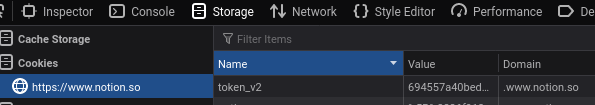

# loitran.com

My personal website. Built with NextJS + Notion + Twitter (comment)

## Usage

- Clone this [Notion template](https://www.notion.so/tdloi/92d4dfe46db243daadcd31aff6aa05cd)
- Public page or open `Dev tools` and copy value of `token_v2` from `Cookie` section in `Storage` tab on Firefox (or `Application` tab on Chrome) 
- Create `env.local` file with following:
```
NOTION_TOKEN=<TOKEN V2>
BLOG_INDEX_ID=<NOTION URL of cloned template page>
INDEX_ID=<NOTION URL of INDEX page>
```
- `npm install` and `npm run dev`

## LICENSE

MIT
